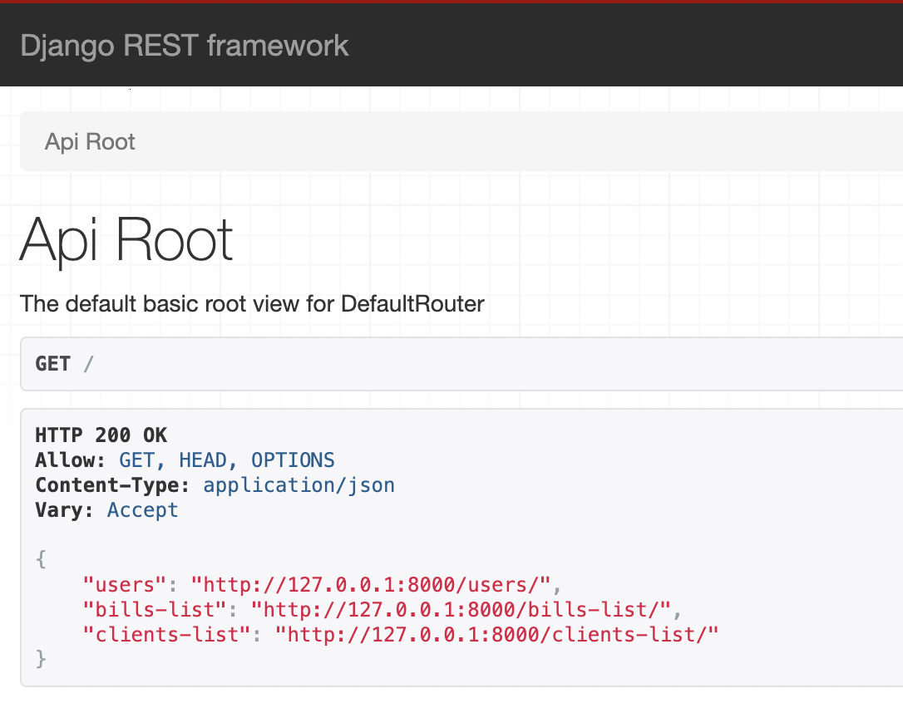
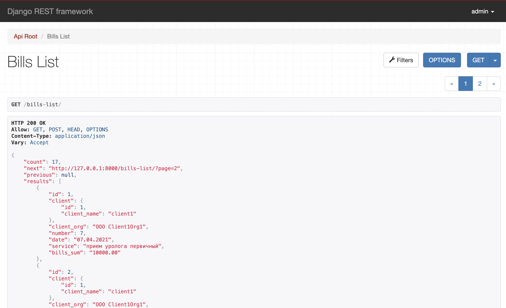
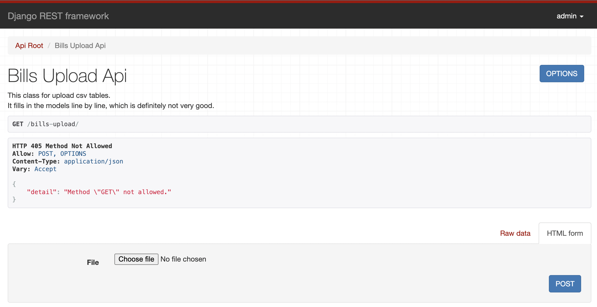
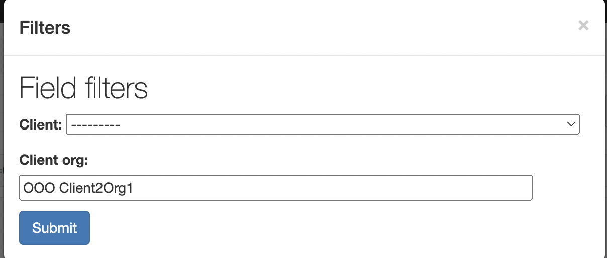

# Django_API

## This project shows an implementation DRF example.




## Project Deployment

```
git clone git@github.com:Dimanoshe/Django_API.git
cd Django_API
python3 -m venv venv
source venv/bin/activate
pip install -r requirements.txt
bash start_project.sh
```

## Loading a .csv table and presenting it to the API



Go to http://127.0.0.1:8000/bills-upload/




The user is created in the start_project.sh script:
user: admin
password: 123
Sign in.

Now you can download the bills.csv file
The downloaded tables can be seen at:
http://127.0.0.1:8000/admin
or
http://127.0.0.1:8000/bills-list/

## Using filters

You can filter data based on client and client_org transmitted to GET
like this:
http://127.0.0.1:8000/bills-list/?client=client2&client_org=OOO+Client2Org1
Filtering through the DRF web interface is also possible.


